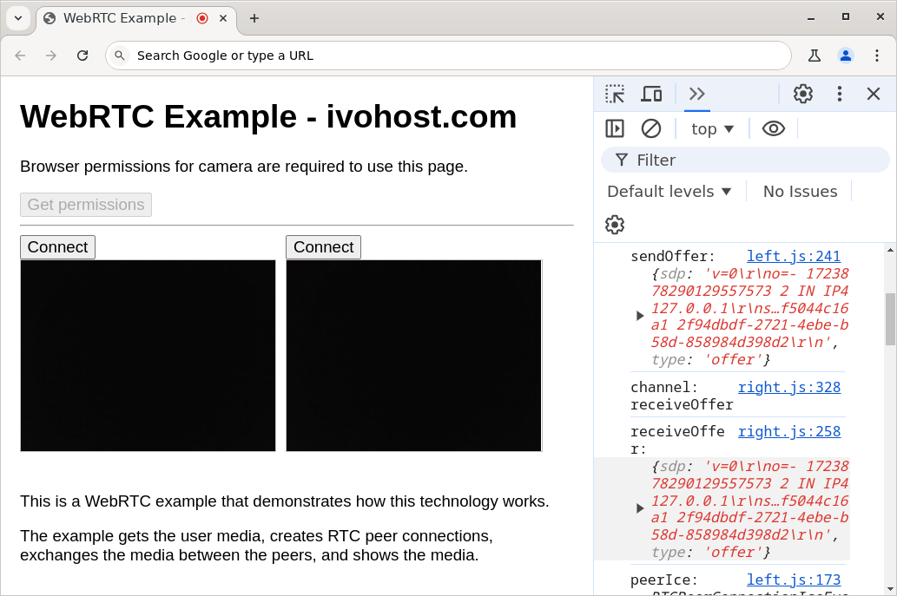

# WebRTC Example - ivohost.com

This is a WebRTC example that demonstrates how this technology works from a
technical perspective.

The example is in JavaScript, gets the user media, creates two RTC peer connections,
exchanges the media between the peers, and shows the media in HTML video
elements.

Demo:  
[https://ivohost.github.io/webrtc-example/](https://ivohost.github.io/webrtc-example/)

Presentation:  
[webrtc-example.pdf](webrtc-example.pdf)

